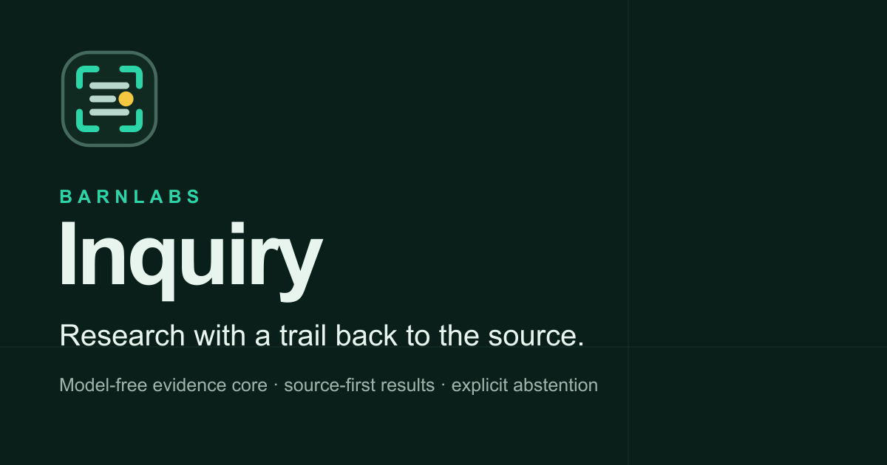
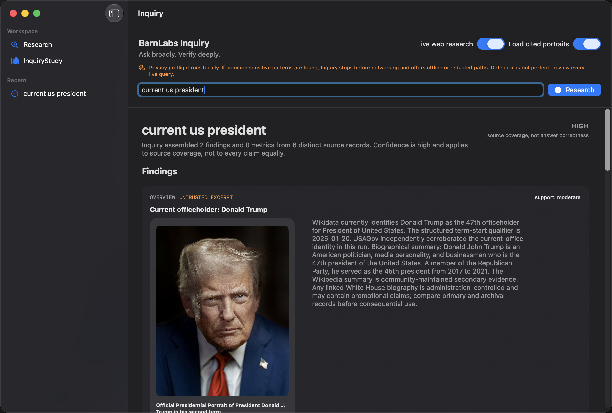
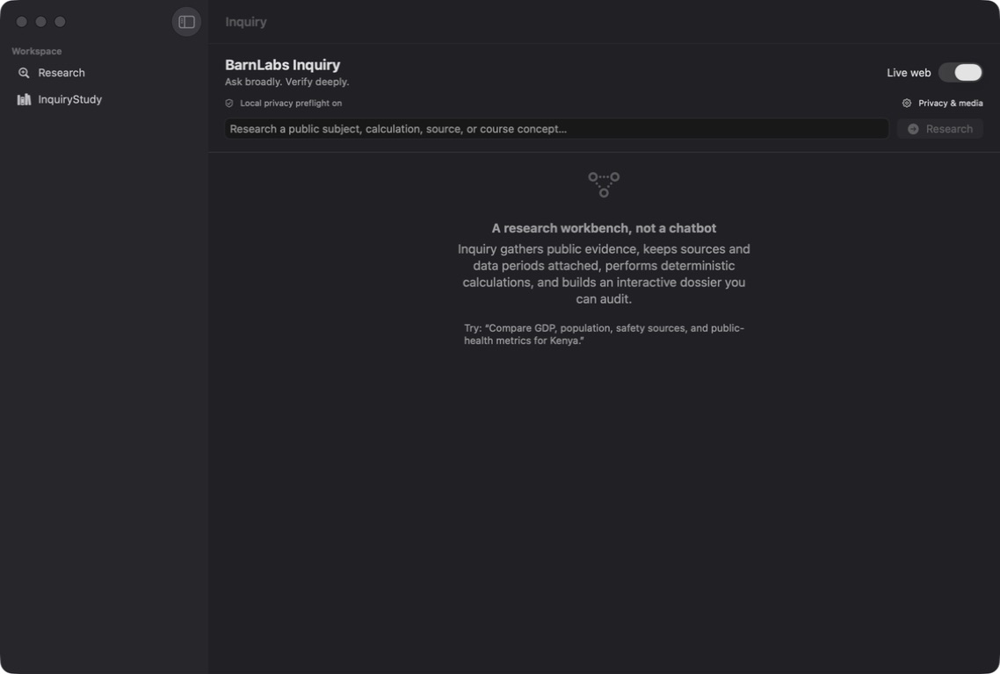
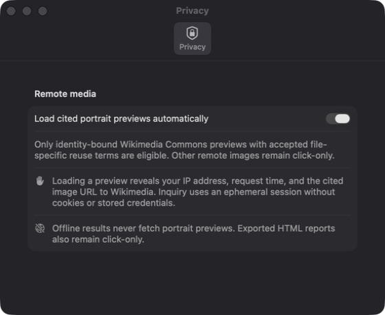

# BarnLabs Inquiry



Inquiry is a local-first research workbench for questions that deserve more than a pile of links. It gathers public evidence, keeps the source trail intact, handles calculations with regular code, and turns the result into a report you can inspect and share.

The project is an early developer preview. The Rust CLI, MCP server, interactive reports, and macOS app all run from this repository. There is no signed macOS download yet.

## What it looks like



Inquiry can research public subjects, compare country data, find papers and books, resolve places, check selected public-health sources, run formulas and conversions, and package the evidence as JSON or a self-contained HTML report.

The macOS app keeps web access visible and under your control:

| Research workspace | Privacy controls |
| --- | --- |
|  |  |

## Why we built it

Search is good at finding pages. It is less good at showing exactly where an answer came from, whether two numbers use the same definition, or what failed along the way.

Inquiry keeps those details with the result:

- findings link back to their source records;
- metrics retain units, dates, geography, and definitions when the source provides them;
- calculations and conversions are deterministic and tested;
- connector errors stay in the run record instead of disappearing;
- reports are self-contained and do not quietly load remote media;
- the core research engine does not require a model or paid API.

It is deliberately cautious. Inquiry will show uncertainty, preserve competing candidates, or stop when the available evidence does not support a clean answer.

## Quick start

You need Rust 1.93 or newer.

```bash
git clone https://github.com/barnlabs/inquiry.git
cd inquiry
cargo build --release --locked
./target/release/inquiry demo --open
```

Try a research question:

```bash
cargo run -- research \
  "Compare GDP, population, safety sources, and public-health metrics for Kenya" \
  --open
```

Or use the tools without a network request:

```bash
cargo run -- research "How is dengue transmitted?" --offline --open
cargo run -- convert 12 mi km
cargo run -- calculate 'sqrt(2)^2 + sin(pi/2)'
cargo run -- graph 'sin(x)' --from -6.283 --to 6.283 --open
```

Run `cargo run -- capabilities` for the current coverage and limitation matrix.

## macOS app

The native client is built with SwiftUI and embeds the Rust engine in the app bundle. It requires Swift 6 and a compatible Xcode toolchain.

```bash
./script/build_and_run.sh
```

To build, launch, and confirm the process is running:

```bash
./script/build_and_run.sh --verify
```

The app also includes InquiryStudy, a private search workspace for a folder you select. Indexes stay in Application Support, and the app provides reveal and confirmed-delete controls. Read [the privacy notes](docs/privacy.md) before using private course material with any hosted MCP client.

## MCP and agent use

Build Inquiry, then start the stdio server:

```bash
./target/release/inquiry mcp
```

Example client configuration:

```json
{
  "mcpServers": {
    "inquiry": {
      "command": "/absolute/path/to/inquiry",
      "args": ["mcp"]
    }
  }
}
```

The server exposes research, report rendering, calculations, statistics, graphs, place resolution, selected medication-label evidence, airport status, study exports, and cited timeline rendering. See [the bundled Inquiry skill](skills/inquiry/SKILL.md) for tool-by-tool guidance and [agent integrations](docs/agent-integrations.md) for setup notes.

Local-study MCP tools are off by default because a hosted client may receive the query and returned excerpt. The CLI and macOS app are the better choice for material that needs to stay on the device.

## How it works

```text
question
   |
   v
policy and privacy checks
   |
   v
reviewed public connectors + deterministic tools
   |
   v
normalized evidence + provenance + run record
   |
   +-- interactive HTML
   +-- JSON
   +-- macOS app
   +-- MCP tools
```

The current connector list and what each source is allowed to support live in [data sources](docs/data-sources.md). The broader trust boundaries are in [architecture](docs/architecture.md) and the exact support and abstention rules are in the [capability matrix](docs/capability-matrix.md).

## Project map

| Path | What belongs there |
| --- | --- |
| `src/` | Rust engine, CLI, connectors, reports, and MCP server |
| `macos/` | SwiftUI app and app tests |
| `docs/` | Architecture, privacy, source, integration, and capability details |
| `brand/` | Canonical marks, wordmarks, social artwork, and the brand kit |
| `script/` | Build, test, packaging, and brand checks |
| `skills/` | The reusable Inquiry agent skill |

Keeping the README short is intentional. Feature-specific behavior belongs beside the code or in the matching document under `docs/`, where it can be reviewed and updated without turning this page into a manual.

## Development

Run the same checks used for ordinary changes:

```bash
cargo fmt --all -- --check
cargo clippy --all-targets -- -D warnings
cargo test
swift test
./script/test_mcp.sh
./script/check_brand.sh
```

Contribution guidelines are in [CONTRIBUTING.md](CONTRIBUTING.md). Security reports should follow [SECURITY.md](SECURITY.md). Planned work is tracked in [ROADMAP.md](ROADMAP.md).

## Brand and license

The [brand folder](brand/) contains the canonical Inquiry artwork, checksums, usage notes, and a downloadable kit. Please use those files instead of redrawing the mark.

The code is licensed under [Apache 2.0](LICENSE). Source websites, datasets, publications, maps, images, standards, and 3D assets keep their own licenses. The BarnLabs and Inquiry names and logos are not licensed for endorsement or confusing redistribution; see [TRADEMARKS.md](TRADEMARKS.md).
